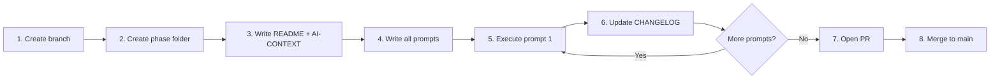

# Phase Workflow — ankurnema.in

> How Claude and the developer collaborate on every unit of work.
> **Rule:** No code changes without a phase folder and at least one prompt file.

---

## What Is a Phase

A phase is a versioned milestone — one feature unit from planning to merged PR.

Phases map 1:1 to the milestones in `CLAUDE.md`'s "Project Phases" table:

| Phase folder | Milestone | Description |
|---|---|---|
| `phase-1-foundation` | v0.1 | Site live, all pages, blog scaffolded |
| `phase-2-content-engine` | v0.2 | Blog live, SEO, RSS feed |
| `phase-3-services-live` | v0.3 | Booking embeds, service pages, lead capture |
| `phase-4-automation` | v0.4 | Newsletter, analytics, performance |
| `phase-5-scale` | v1.0 | Course page, resources, community |

---

## Folder Structure

Each phase lives under `developer/`:

```
developer/
└── phase-N-short-name/
    ├── README.md          ← objective, deliverables, success criteria, branch name
    ├── AI-CONTEXT.md      ← token-efficient guide: what to read, what to skip
    ├── CHANGELOG.md       ← dated log updated after every prompt execution
    └── prompts/
        ├── README.md      ← index of all prompts + one-liner + status
        ├── 001-short-name.md
        └── 002-short-name.md
```

---

## Phase Lifecycle

Follow these steps in order — no skipping:



1. **Create branch** — `git checkout -b feature/phase-N-short-name` from main
2. **Create phase folder** — under `developer/phase-N-short-name/`
3. **Write README + AI-CONTEXT** — define scope before touching code
4. **Write all prompts** — break phase into discrete deliverables, one prompt each
5. **Execute one prompt** — paste into Claude, complete the work
6. **Update CHANGELOG** — log what was done, files created/modified, decisions made
7. **Repeat 5–6** for each remaining prompt
8. **Open PR** — `feature/phase-N-name` → `main`; write phase summary in `docs/phases/`
9. **Merge** — after review

---

## Git Conventions

- Branch per phase: `feature/phase-N-short-name` (e.g., `feature/phase-1-foundation`)
- Branch off `main`, merge back to `main` via PR
- One phase = one PR
- Commit format: Conventional Commits (`feat:`, `fix:`, `chore:`, `docs:`)

---

## README.md (per phase)

Required sections:

```markdown
# Phase N — Name (vX.Y)

## Objective
[1–2 sentences: what this phase achieves]

## Branch
`feature/phase-N-short-name`

## Deliverables
- [ ] [deliverable 1]
- [ ] [deliverable 2]

## Success Criteria
- [How to know the phase is done]

## Out of Scope
- [Explicit exclusions — what belongs in a later phase]
```

---

## AI-CONTEXT.md (per phase)

Purpose: let Claude orient fast without scanning the whole repo. Keep it short.

Required sections:

```markdown
# AI Context — Phase N: Name

## Reading Order
Read these files first, in this order:
1. `developer/phase-N-name/README.md` — phase scope
2. `CLAUDE.md` — project conventions
3. [other key files for this phase]

## Key Files for This Phase
| File | Why |
|------|-----|
| `path/to/file` | reason it matters for this phase |

## Reuse — Existing Utilities
- `path/to/util.ts` — [what it does, use it for X]

## Do Not Read
- `developer/adr/` — not needed for this phase
- `src/content/blog/` — not needed for this phase

## Phase-Specific Conventions
- [anything specific to this phase beyond base CLAUDE.md rules]
```

---

## Prompt File Format

Each file in `prompts/` is a self-contained unit:

```markdown
# Prompt NNN — Short Name

## Read First
- `path/to/file` — why
- `path/to/file` — why

## Scope
**In scope:** [explicit list of what this prompt covers]
**Out of scope:** [explicit exclusions]

## End Deliverable
[Exact description of what exists when this prompt is done — files, behaviour, tests]

## Prompt
[The exact prompt text. Copy this and paste it into Claude to execute.]
```

Naming: `NNN-short-description.md` (e.g., `001-scaffold-nextjs.md`, `002-setup-cicd.md`)

---

## prompts/README.md Format

The index that makes the phase scannable at a glance:

```markdown
# Prompts — Phase N: Name

| # | File | Description | Status |
|---|------|-------------|--------|
| 001 | 001-scaffold-nextjs.md | Scaffold Next.js 16 with TS + Tailwind + MDX | ✅ Done 2026-05-10 |
| 002 | 002-setup-cicd.md | GitHub Actions CI/CD for lint, build, deploy | ⏳ Pending |
```

Status values: `⏳ Pending` | `🔄 In Progress` | `✅ Done YYYY-MM-DD`

---

## CHANGELOG.md Format

Updated after every prompt execution:

```markdown
# CHANGELOG — Phase N: Short Name

## [YYYY-MM-DD] Prompt NNN — Description
- What was done (summary)
- Files created: `path/to/file`, `path/to/file`
- Files modified: `path/to/file`
- Decisions made: [any choice made that is not obvious]
```

---

## Phase Completion Checklist

Before opening the PR:

- [ ] All prompt checkboxes in `prompts/README.md` marked Done
- [ ] All deliverables in `README.md` checked off
- [ ] `CHANGELOG.md` has an entry for every prompt executed
- [ ] `AI-SUMMARY.md` updated (Recent Completions + milestone status)
- [ ] `AI-REFERENCE.md` updated with any new files/folders
- [ ] `CLAUDE.md` "Project Phases" table updated to ✅ Complete
- [ ] Phase summary written to `docs/phases/phase-N-name-completion.md`
- [ ] PR opened: `feature/phase-N-name` → `main`
