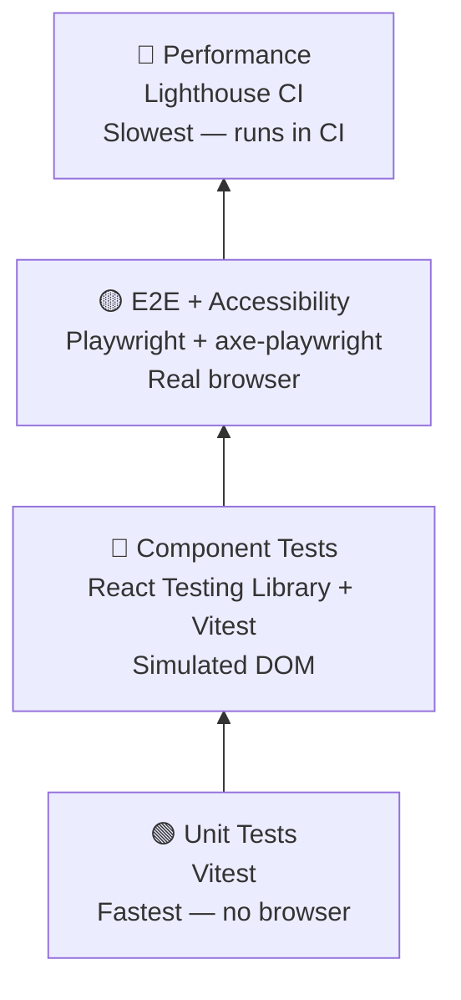

# ADR-005: Testing Strategy

| Field | Value |
|-------|-------|
| **Status** | Accepted |
| **Date** | May 2026 |
| **Decided by** | Ankur Nema |
| **Related** | [ADR-003](003-nextjs-mcp-server.md), [ADR-004](004-playwright-cli-browser-testing.md) |

---

## Context

ankurnema.in is a Next.js 16 website with a blog, service pages, and a contact form. It is also
an open-source case study in AI-assisted development — the testing setup should reflect
professional standards that others can learn from.

Testing a website serves two purposes:
1. **Catch regressions** — a change to the navbar shouldn't break the blog page
2. **Build confidence** — deploy knowing the critical paths work before visitors see them

A website like ankurnema.in has multiple layers that need different kinds of testing.
Using one tool for everything (or skipping testing entirely) both lead to poor outcomes.
This ADR defines which tools cover which layer, and the phased rollout to avoid
over-engineering a personal site before it has real users.

> **Glossary for freshers:**
> - **Unit test:** A test for one small function in isolation. Input goes in, expected output
>   comes out. Fast to run, easy to write.
> - **Component test:** A test for a React component — does it render the right HTML given
>   certain props? Does a button click trigger the right action?
> - **End-to-end (E2E) test:** A test that opens a real browser, navigates to a page, clicks
>   things, and checks what the user would actually see. Slow but realistic.
> - **Visual regression test:** A screenshot taken of a page is compared to a reference
>   screenshot. If pixels change unexpectedly, the test fails.
> - **Accessibility test:** Automated checks that the site can be used by people with
>   disabilities — screen reader compatibility, colour contrast, keyboard navigation.
> - **Core Web Vitals:** Google's measurements of page performance: how fast it loads
>   (LCP), how stable the layout is (CLS), how quickly it responds to input (FID/INP).
>   These directly affect SEO rankings.
> - **CI/CD:** Tests that run automatically on every code change before it goes live.

---

## Testing Layers

A complete testing strategy covers four distinct layers. Each requires a different tool
because each tests at a different level of the stack.



---

## Layer 1: Unit Tests

**What:** Pure functions — MDX processing helpers, date formatters, slug generators,
metadata builders, any utility in `src/lib/`.

### Options Considered

**Jest**
The long-standing default for JavaScript testing.

| | Detail |
|--|--------|
| Good | Huge community, extensive documentation |
| Bad | Requires significant configuration to work with Next.js 16's ESM modules |
| Bad | Slower than Vitest — does not use native ES modules |
| Bad | Configuration overhead adds friction to a simple personal project |
| Verdict | Rejected |

**Vitest** ✅
A modern test runner built on Vite. ESM-native, fast, minimal configuration.

| | Detail |
|--|--------|
| Good | Works with Next.js 16 out of the box — no config gymnastics |
| Good | Significantly faster than Jest — runs tests in parallel natively |
| Good | Identical API to Jest — any Jest knowledge transfers directly |
| Good | Same tool runs both unit and component tests — one runner, less setup |
| Good | First-class TypeScript support |
| Verdict | Accepted |

---

## Layer 2: Component Tests

**What:** React components — `<BlogCard>`, `<NavBar>`, `<ServiceCard>`, `<ContactForm>`.
Does the component render the right content? Does a button click fire the right handler?

### Options Considered

**Storybook**
A dedicated component development and testing environment.

| | Detail |
|--|--------|
| Good | Visual component explorer — great for design systems |
| Bad | Heavy setup for a single-developer project |
| Bad | Overkill when there is no design system or team needing component documentation |
| Verdict | Rejected for this phase — revisit if a component library grows |

**React Testing Library + Vitest** ✅
The industry standard for testing React components. Tests behaviour, not implementation.

| | Detail |
|--|--------|
| Good | Same runner as unit tests (Vitest) — one install, one config, one command |
| Good | Tests what the user sees and does, not internal component state |
| Good | Works with Next.js App Router components |
| Good | Largest community of any React testing library |
| Verdict | Accepted |

> **Why "tests behaviour, not implementation" matters:**
> Bad tests break when you rename a variable. Good tests only break when the component
> actually stops working for the user. React Testing Library enforces the good approach.

---

## Layer 3: End-to-End (E2E) Tests

**What:** Real browser flows — homepage loads correctly, blog post renders with full content,
contact form submits, navigation links work, mobile layout is intact.

### Options Considered

**Puppeteer**
Google's browser automation library. The original tool in this space.

| | Detail |
|--|--------|
| Good | Lightweight, direct Chrome DevTools Protocol access |
| Bad | Chrome and Chromium only — cannot test Firefox or Safari/WebKit |
| Bad | Less test-oriented than Playwright — more of an automation tool |
| Bad | Effectively superseded by Playwright for testing use cases |
| Verdict | Rejected |

**Cypress**
A popular E2E testing framework with excellent developer experience.

| | Detail |
|--|--------|
| Good | Very beginner-friendly UI and debugging experience |
| Good | Large community, extensive plugin ecosystem |
| Good | Time-travel debugging — see exactly what happened at each test step |
| Bad | Historically Chrome-only (multi-browser support added later, still limited) |
| Bad | Slower test execution than Playwright |
| Bad | Cypress Cloud (for CI parallelization and recording) requires a paid plan |
| Bad | Adding Playwright is already justified by ADR-004 — using Cypress would mean maintaining two browser tools |
| Verdict | Rejected — strong tool, but Playwright is already in the stack |

**Playwright** ✅
Microsoft's browser automation and testing framework. Current industry standard for E2E testing.

| | Detail |
|--|--------|
| Good | Chromium, Firefox, and WebKit (Safari engine) — one test, three browsers |
| Good | Fast — parallel test execution by default |
| Good | Built-in screenshot and visual regression testing |
| Good | Already in the project via ADR-004 (`playwright-cli` for dev-time) — same investment, two use cases |
| Good | Trace viewer — records full test run with screenshots, network, console logs for debugging |
| Good | Auto-waiting — tests don't need manual `sleep()` calls; Playwright waits for elements automatically |
| Good | `axe-playwright` integrates accessibility testing directly into E2E tests |
| Verdict | Accepted |

---

## Layer 4: Accessibility Testing

**What:** Automated checks that pages meet WCAG accessibility standards — colour contrast,
keyboard navigation, missing alt text, improper heading structure, missing ARIA labels.

### Options Considered

**Pa11y**
A standalone accessibility testing CLI.

| | Detail |
|--|--------|
| Good | Simple to run as a standalone command |
| Bad | Separate tool — another thing to install, configure, and run |
| Bad | Does not integrate into the Playwright test suite — separate CI step |
| Verdict | Rejected |

**axe-playwright** ✅
The `axe` accessibility engine (by Deque Systems, the industry standard) integrated directly
into Playwright tests.

| | Detail |
|--|--------|
| Good | Runs inside existing Playwright tests — no new tool, no new CI step |
| Good | `axe` is the most trusted accessibility rule engine available |
| Good | One line added to a Playwright test: `await checkA11y(page)` |
| Good | Catches ~57% of accessibility issues automatically (the ones catchable by static analysis) |
| Verdict | Accepted |

---

## Layer 5: Performance Testing

**What:** Core Web Vitals — Largest Contentful Paint (LCP), Cumulative Layout Shift (CLS),
Interaction to Next Paint (INP). These affect both user experience and SEO rankings.

### Options Considered

**web-vitals (JS library)**
A Google library that measures real user performance in the browser.

| | Detail |
|--|--------|
| Good | Measures real user experience on the live site |
| Bad | Reactive — you find out about performance problems after deployment |
| Bad | Not a CI gate — cannot fail a PR build based on performance |
| Neutral | Useful as a monitoring tool alongside Google Analytics 4 — not a replacement for CI testing |
| Verdict | Used for production monitoring (GA4 integration), not as the CI performance gate |

**Lighthouse CI** ✅
Google's Lighthouse audit tool configured to run automatically in GitHub Actions on every PR.

| | Detail |
|--|--------|
| Good | Runs before deployment — catches regressions before visitors see them |
| Good | Can fail a PR build if performance score drops below a threshold |
| Good | Covers performance, accessibility, best practices, and SEO in one audit |
| Good | Free — runs in your own GitHub Actions minutes |
| Good | Produces a detailed report linked directly in the PR |
| Verdict | Accepted |

---

## Decision

**The full testing stack:**

| Layer | Tool | When it runs |
|-------|------|-------------|
| Unit tests | Vitest | On every file save (watch mode) + CI |
| Component tests | React Testing Library + Vitest | CI on every PR |
| E2E tests | Playwright | CI on every PR |
| Visual regression | Playwright (screenshots) | CI on every PR |
| Accessibility | axe-playwright | CI on every PR (inside Playwright tests) |
| Performance | Lighthouse CI | CI on every PR |
| Dev-time browser | playwright-cli (ADR-004) | Local development only |

**Single command for all tests:**
```bash
npm run test        # Vitest unit + component tests
npm run test:e2e    # Playwright E2E + accessibility tests
```

---

## Phased Rollout

Testing is only valuable if it is maintained. Adding all layers at once before the site has
real pages to test is waste. This phase plan adds testing in step with the site itself.

### Phase 1 — With initial scaffold (v0.1)
- [ ] Vitest configured — runs `npm run test`
- [ ] Playwright configured — runs `npm run test:e2e`
- [ ] 3 critical E2E tests: homepage renders, blog index renders, contact page renders
- [ ] Lighthouse CI in GitHub Actions — fail PR if performance score < 80

### Phase 2 — After blog goes live (v0.2)
- [ ] axe-playwright added to existing E2E tests — one `checkA11y` call per page
- [ ] Vitest unit tests for MDX processing utilities in `src/lib/`
- [ ] Visual snapshot tests for homepage and blog post layout

### Phase 3 — After service pages go live (v0.3)
- [ ] React Testing Library component tests for `<ServiceCard>`, `<ContactForm>`
- [ ] Playwright E2E for contact form submission flow
- [ ] Cross-browser test run (Chromium + Firefox + WebKit) added to CI

---

## Consequences

**Benefits:**
- Regressions caught before deployment — not discovered by visitors
- Lighthouse CI enforces performance standards on every PR (protects SEO)
- Playwright's trace viewer makes debugging failed tests fast — no guessing what went wrong
- axe-playwright gives accessibility coverage with near-zero extra setup
- Single browser tool (Playwright) covers dev-time verification, E2E, visual, and accessibility

**Tradeoffs:**
- CI pipeline takes longer than with no tests — expected and acceptable
- Playwright requires browser binaries in CI (GitHub Actions has these pre-installed on ubuntu-latest)
- Visual snapshot tests require updating reference screenshots when intentional design changes are made

**What this does NOT cover:**
- Load testing / stress testing — not needed for a personal brand site at this scale
- Real user monitoring — handled by Google Analytics 4 in production
- Manual QA — some things (design feel, copy tone) cannot be automated

---

## Review Trigger

Revisit this strategy if:
- The site grows to include user accounts or transactional flows (would warrant a full QA process)
- A better tool replaces Playwright as the E2E standard
- CI costs become a concern (Lighthouse CI and Playwright are both free — very unlikely)
