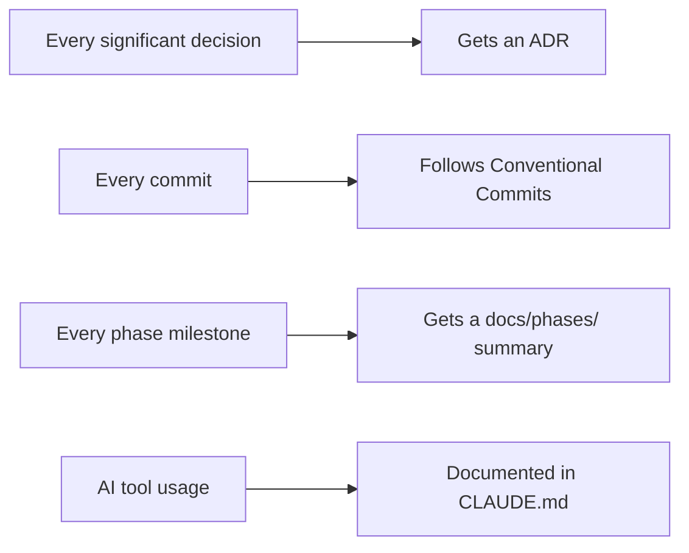

# ADR-006: Open-Source Repo as AI-Assisted Development Case Study

| Field | Value |
|-------|-------|
| **Status** | Accepted |
| **Date** | May 2026 |
| **Decided by** | Ankur Nema |

---

## Context

Most personal brand websites keep their source code private. There is no technical reason a
portfolio site needs to be public. However, the audience for ankurnema.in — DevOps engineers,
platform engineers, developers looking to grow their careers — is exactly the audience that
values seeing real code, real decisions, and real process.

This ADR documents the deliberate decision to make the repo public and structure it as a
learning resource, and what that means for how the codebase is maintained.

> **Glossary for freshers:**
> - **Open-source:** The code is publicly visible — anyone can read it, fork it, learn from it.
> - **Case study:** A documented, real-world example that others can study and replicate.
> - **ADR (Architecture Decision Record):** A document that records why a technical decision
>   was made. You are reading one right now.
> - **Conventional Commits:** A standard for writing git commit messages that makes history
>   readable. Example: `feat: add contact form`, `fix: correct blog post date`.

---

## Options Considered

### Option 1 — Private repo (standard approach)

Keep the source code private. The website is public, the code is not.

| | Detail |
|--|--------|
| Good | No obligation to keep code clean for public consumption |
| Good | Business logic, workflow decisions stay internal |
| Bad | Misses a significant content opportunity with the exact target audience |
| Bad | Does not demonstrate technical capability beyond what the live site shows |
| Bad | No differentiation from every other consultant's website |
| Verdict | Rejected |

---

### Option 2 — Public repo, no case study framing

Open-source the code but treat it as a standard project repository — no explicit learning angle,
no AI documentation, no ADRs beyond basic notes.

| | Detail |
|--|--------|
| Good | Code is visible for credibility |
| Neutral | Some people will find it useful |
| Bad | No structure for learners — just a pile of code |
| Bad | Does not tell the story of how and why the site was built |
| Bad | Misses the AI-assisted development angle that is authentic to how this project was actually built |
| Verdict | Rejected — open-sourcing without purpose is half a decision |

---

### Option 3 — Public repo as AI-assisted development case study (Chosen)

Structure the repo explicitly as a learning resource showing how to build a real project
using AI-assisted development — from planning through deployment.

| | Detail |
|--|--------|
| Good | The target audience (engineers) values seeing real process, not just output |
| Good | AI-assisted development is the authentic story — Claude Code was used to build this |
| Good | ADRs, CLAUDE.md, conventional commits, phased milestones become teaching material |
| Good | Attracts the exact audience Ankur is targeting for consulting and mentoring |
| Good | Demonstrates planning discipline, architectural thinking, and AI workflow fluency |
| Good | Open GitHub repo = more inbound surface area (GitHub search, starred repos, forks) |
| Good | Doubles as proof of technical depth and documentation skills |
| Neutral | Code must be kept clean enough for public consumption — this is a discipline benefit |
| Verdict | Accepted |

---

## Decision

**The `ankurnema.in` repo is public and structured as a case study in AI-assisted development.**

The case study demonstrates:
1. How to plan a real project with AI (strategy plan, prompts, decisions)
2. How to use Architecture Decision Records for transparency
3. How to structure a Next.js 16 personal site professionally
4. How to set up CI/CD for a personal project with GitHub Actions + Vercel
5. How to write conventional commits that make git history readable
6. How to use Claude Code (MCP, next-devtools-mcp, playwright-cli) in a real workflow

---

## What This Means in Practice

### What must always be true

### What stays private

Business operations, client data, and commercial content are kept in a separate private
repository and never committed here.

### CONTRIBUTING.md

A `CONTRIBUTING.md` is needed to welcome learners and explain how to run the project locally.
Anyone who forks this repo to learn should be able to get started without confusion.

### README.md

The root `README.md` explicitly introduces the case study angle — not just "here is my website
code" but "here is how I built it and what you can learn from it."

---

## Reasons

**The audience overlap is exact.**
People who read DevOps blogs, follow engineering leaders on LinkedIn, and look for career
mentors are also the people who browse open-source repos on GitHub. Making this repo public
creates a second discovery channel for the same audience.

**Authenticity beats polish.**
This site was genuinely built using Claude Code, planned with AI-assisted strategy sessions,
and documented with ADRs written during the build. Hiding that process would be false
modesty. The case study framing makes the process the product.

**It enforces discipline.**
Knowing the code is public creates a natural pressure to write clean commits, maintain
documentation, and follow through on the conventions defined here. That discipline benefits
the project regardless of whether anyone ever reads it.

---

## Consequences

**Benefits:**
- GitHub profile shows a well-structured, documented, professional repo
- Case study content is shareable: LinkedIn posts, blog articles can link to specific ADRs or
  phases as real examples
- Learners can fork and adapt the structure for their own personal sites
- CI/CD pipeline itself is a portfolio piece visible to anyone

**Tradeoffs:**
- Code quality expectation is higher — sloppy commits or broken builds are publicly visible
- Any business logic must be kept in the private business repo — no exceptions
- Dependencies must be kept updated (public repo with outdated dependencies looks neglected)

**New files required by this decision:**
- `CONTRIBUTING.md` — how to run locally, how to contribute, code of conduct
- `README.md` — case study overview (already exists, needs case study framing)
- `.github/ISSUE_TEMPLATE/` — structured templates for features and blog posts
- `.github/PULL_REQUEST_TEMPLATE.md` — PR checklist for contributors

---

## Review Trigger

This decision is permanent for the life of the project. Revisit only if:
- A specific security or privacy concern arises requiring the repo to be made private
- The case study angle no longer serves the audience or brand goals
