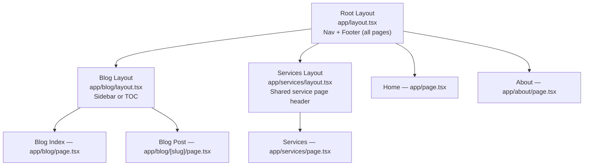
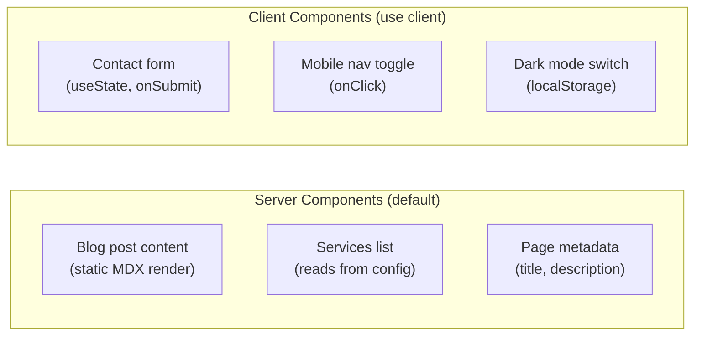

# ADR-007: Next.js App Router over Pages Router

| Field | Value |
|-------|-------|
| **Status** | Accepted |
| **Date** | May 2026 |
| **Decided by** | Ankur Nema |
| **Related** | [ADR-001](001-tech-stack.md) — Tech stack decision |

---

## Context

Next.js has two routing systems that can be used to build the same kinds of pages. They are
architecturally very different, and choosing one shapes how every page and component in the
project is written. This choice must be made before any code is written.

> **Glossary for freshers:**
> - **Routing:** How a website decides which page to show based on the URL. `/blog` shows
>   the blog page, `/about` shows the about page — routing is the system that maps URLs to pages.
> - **Pages Router:** The original Next.js routing system. Pages live in a `pages/` folder.
>   Each file becomes a route. Used by most Next.js projects built before 2023.
> - **App Router:** The new Next.js routing system introduced in Next.js 13. Pages live in
>   an `app/` folder. Uses React Server Components by default.
> - **React Server Component (RSC):** A React component that runs only on the server. It
>   never sends its JavaScript to the browser — just the finished HTML. Faster and lighter.
> - **`use client`:** A directive you add to a component file when it needs to run in the
>   browser (for event handlers, browser APIs, React hooks like `useState`).
> - **Server Action:** A function that runs on the server, called directly from a React
>   component. Used for form submissions without writing a separate API endpoint.
> - **Nested layouts:** A shared UI wrapper (like a navbar or sidebar) that wraps a group
>   of pages. With App Router, layouts are composable — each folder can have its own layout.
> - **ISR (Incremental Static Regeneration):** Pre-build pages for speed, but refresh them
>   in the background on a schedule without a full redeploy.

---

## The Two Options

### Option 1 — Pages Router (Legacy)

The original routing system. Every `.tsx` file inside `pages/` becomes a route.
Data fetching uses `getServerSideProps` (SSR) or `getStaticProps` (SSG).

```
pages/
├── index.tsx          → /
├── about.tsx          → /about
├── blog/
│   ├── index.tsx      → /blog
│   └── [slug].tsx     → /blog/post-title
└── contact.tsx        → /contact
```

| | Detail |
|--|--------|
| Good | Mature, stable, very well documented — thousands of tutorials exist |
| Good | Lower learning curve for developers new to Next.js |
| Good | All third-party libraries have Pages Router compatibility |
| Bad | In maintenance mode — Vercel has stopped adding new features to Pages Router |
| Bad | No React Server Components — all components ship JavaScript to the browser |
| Bad | `getServerSideProps` / `getStaticProps` are verbose and separate from the component |
| Bad | Shared layouts require a custom `_app.tsx` pattern — less intuitive |
| Bad | No Server Actions — form submissions require separate API routes in `pages/api/` |
| Verdict | Rejected |

---

### Option 2 — App Router (Chosen)

The modern routing system, default since Next.js 13, recommended in Next.js 16.
Pages live in `app/` folders. Every component is a Server Component by default.

```
app/
├── page.tsx           → /
├── about/
│   └── page.tsx       → /about
├── blog/
│   ├── page.tsx       → /blog
│   └── [slug]/
│       └── page.tsx   → /blog/post-title
└── contact/
    └── page.tsx       → /contact
```

| | Detail |
|--|--------|
| Good | Default and recommended in Next.js 16 — full Vercel team support |
| Good | React Server Components by default — less JavaScript shipped to the browser |
| Good | Nested layouts — each folder can have a `layout.tsx` that wraps its children |
| Good | Server Actions — form submissions as functions, no `pages/api/` needed |
| Good | Streaming — page content loads progressively, faster perceived load time |
| Good | Colocation — data fetching lives inside the component that uses the data |
| Good | Better SEO defaults — server-rendered content is immediately readable by Google |
| Neutral | `use client` directive needed for interactive components (useState, event handlers) |
| Neutral | Smaller number of tutorials vs Pages Router (growing fast, not a long-term concern) |
| Bad | Some older third-party libraries may need a `use client` wrapper to work |
| Verdict | Accepted |

---

## Decision

**Use the Next.js App Router** (`app/` directory) for all routing in ankurnema.in.

Pages Router (`pages/` directory) is not used anywhere in this project.

---

## How App Router Shapes This Project

### Layouts

The site has natural layout nesting that App Router handles cleanly:



### Server vs Client Components

Not all components need to run in the browser. App Router makes this explicit:



### Blog Post Data Fetching

With App Router, data fetching is co-located with the component that uses it — no
`getStaticProps` separated from the page:

```typescript
// app/blog/[slug]/page.tsx
export default async function BlogPost({ params }) {
  const post = await getPostBySlug(params.slug)  // runs on server
  return <article>{post.content}</article>
}
```

### Contact Form with Server Actions

Form submissions use Server Actions — no separate API route needed:

```typescript
// app/contact/page.tsx
async function submitContact(formData: FormData) {
  'use server'
  // runs on the server, called directly from the form
  await sendEmail(formData.get('email'))
}
```

---

## Reasons

**App Router is the future of Next.js, Pages Router is the past.**
Vercel has explicitly stated that Pages Router is in maintenance mode. No new features will
be added. Starting a project in 2026 on Pages Router is choosing a deprecated path from day one.

**React Server Components reduce JavaScript bundle size.**
Every component is a Server Component by default. Only components that genuinely need the
browser (event handlers, hooks) get the `use client` directive. Less JavaScript shipped =
faster site = better SEO = better Core Web Vitals.

**Nested layouts match this site's structure naturally.**
The nav and footer wrap all pages (root layout). The blog has its own layout with a table of
contents. The services section has a shared header. App Router's layout system handles this
without custom wrapper components.

**Server Actions eliminate boilerplate.**
The contact form needs to send an email. With Pages Router that means a `pages/api/contact.ts`
file, a `fetch` call from the form, error handling on both sides. With App Router Server Actions,
the function lives next to the form and is called directly.

---

## Consequences

**Benefits:**
- Less JavaScript in the browser — faster load times, better Lighthouse scores
- Cleaner project structure — data fetching lives with the component that uses it
- Server Actions simplify the contact form significantly
- Nested layouts remove repetitive wrapper boilerplate
- Full Vercel optimisation support for App Router features

**Tradeoffs:**
- Components using `useState`, `useEffect`, `onClick`, or browser APIs need `'use client'`
  — easy rule to follow but requires awareness
- Some third-party npm packages not yet App Router compatible require a thin `use client`
  wrapper component

**Conventions that follow from this decision:**
- All pages live in `app/` — never in `pages/`
- Shared UI that wraps pages is a `layout.tsx`, not a HOC or `_app.tsx` pattern
- Default to Server Components — add `'use client'` only when the browser is genuinely needed
- Data fetching is `async/await` inside components — no `getServerSideProps`

---

## Review Trigger

This decision is stable for the life of the project. Next.js will not remove App Router support.
Revisit only if a hard incompatibility with a critical third-party library is encountered that
cannot be resolved with a `use client` wrapper.
